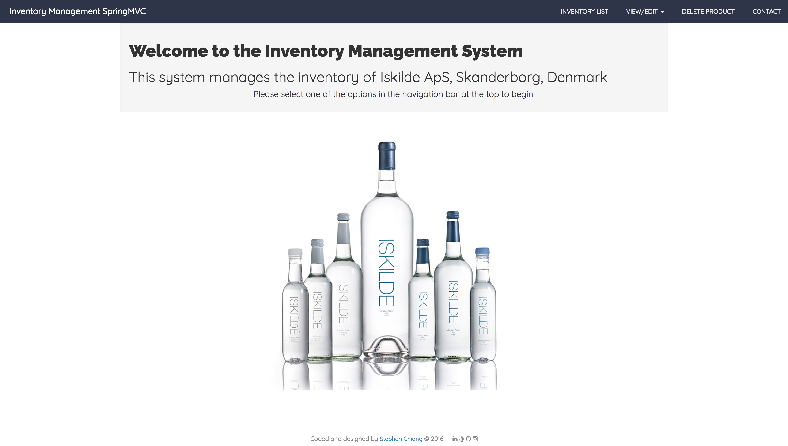
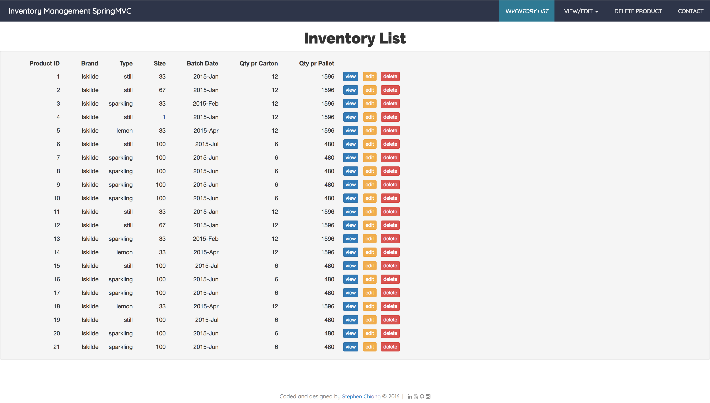
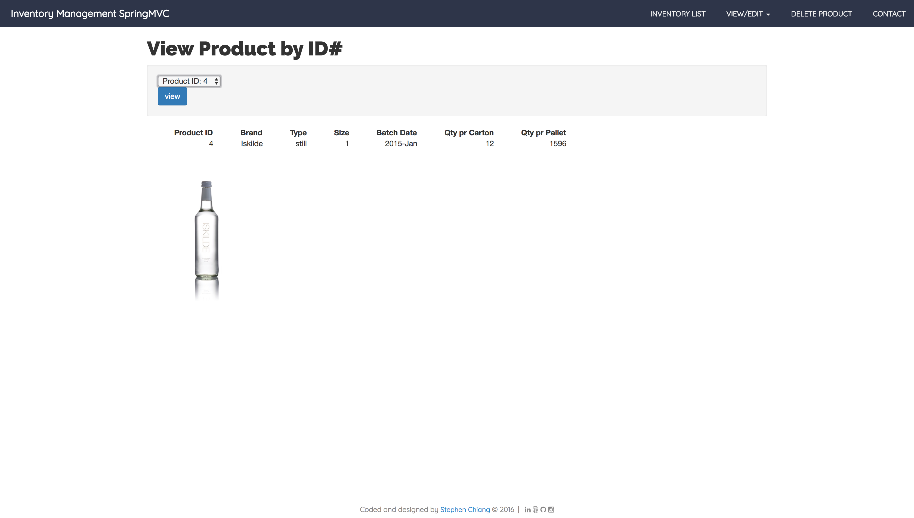
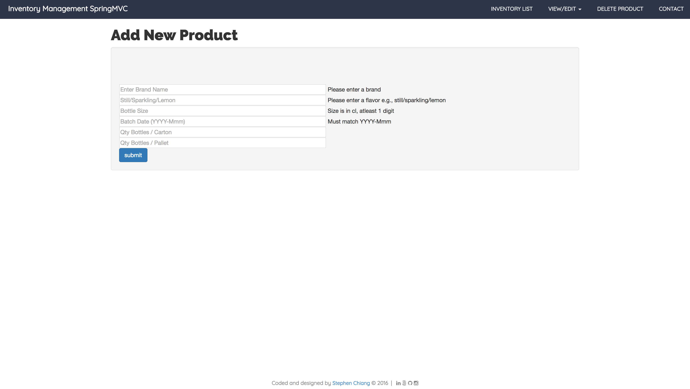
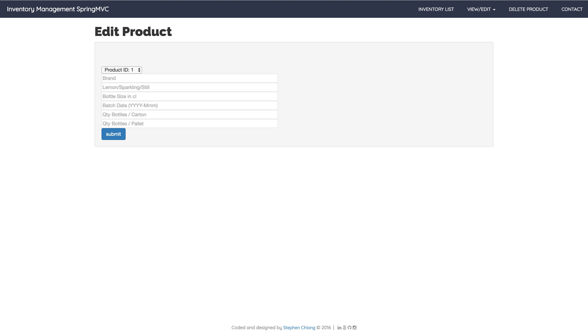
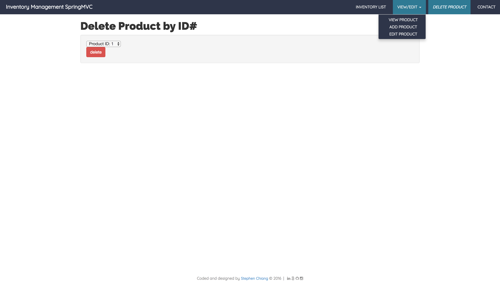

# Summary
An inventory management web-app using Java and the Spring MVC framework with CRUD functionality. Although this web-app implements session control, the database does not persist and reverts back to the original state of pre-loaded inventory when the server is restarted. This project is a Maven configured project built in the Spring Tool Suite w/ SpringMVC dependencies.

This web-app is my first attempt at using SpringMVC. I first wrote JUnit tests but ran into an odd problem where the IDE didn't detect any test cases which I'll attempt to resolve before zipping into .war and deploying to AWS. I then proceeded to fill out methods that resulted in output via Java Server Pages with html/css/bootstrap. I provided the user the ability to manipulate data in many ways but also attempted to engineer limits to prevent misuse of the app. By and large, the web-app is mobile friendly with a toggling hamburger menu, however the data table needs a little work.

<p align="center">

</p>
<p align="center">

</p>
<p align="center">

</p>

## In This Document
1. [How to Execute](#how-to-execute)
2. [Class Structure Overview](#class-structure-overview)

## How to Execute
- The web-app is hosted on: insert URL <a href="http://www.chiangs.ninja:8080/InventoryMGRSpringMVCCRUD/">**here**</a>
- Download the entire program as a .war file <a href="InventoryMGRSpringMVCCRUD.war">**here**</a>

## Instructions
1. User arrives on landing page.
2. User menu:
    - View All Products
    - View Details of a Product
    - Edit Product
    - Add New Product
    - Delete Product
3. Each product manipulation option can also be executed directly from the inventory overview.

## Class Structure Overview
- The **ProductIMSController** class is the controller and interacts with the **ProductDAOImpl** class which implements methods declared in the **ProductDAO** interface. The product and list objects are constructed using information from the **Product** class and accompanying .csv file pre-loaded with inventory information.
- The **ProductIMSController** provides information back through **.jsp** files for the user to view and manipulate.


## Code Examples
**example of edit product controller code with form validation logic**
```
@RequestMapping(path = "EditProductData.do", method = RequestMethod.POST)
	public ModelAndView editByID(@Valid Product product, Errors errors) {
		ModelAndView mv = new ModelAndView();
		if (errors.getErrorCount() != 0 ) {
			mv.setViewName("editProduct");
			return mv;
		} else {
			mv.addObject("inventory", productService.editProduct(product));
			mv.setViewName("viewInventory");
			return mv;			
		}
	}
    ```
